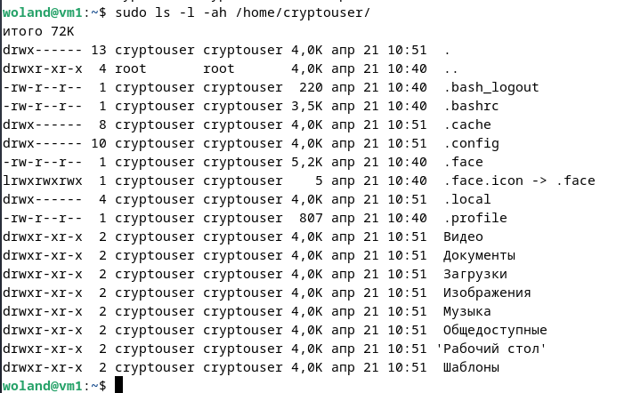
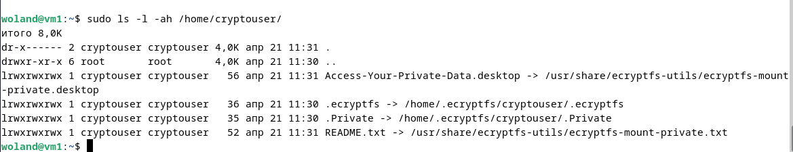
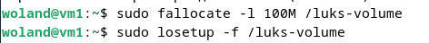
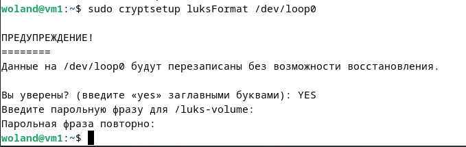
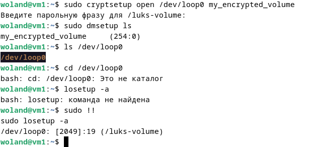
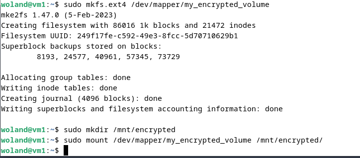
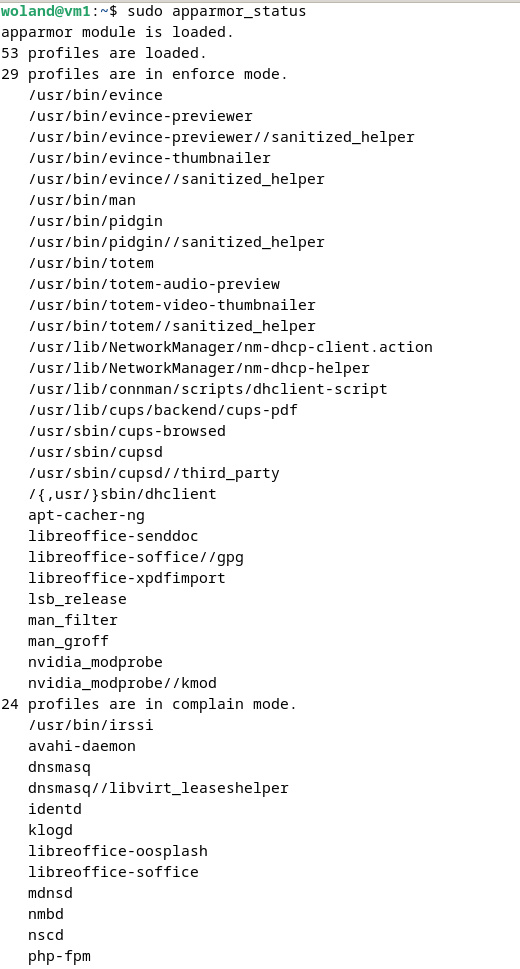
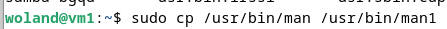
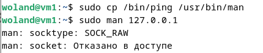
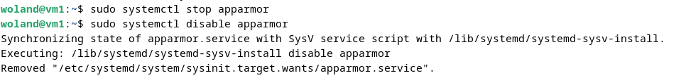

# HW13-02

## Задание 1

1. Установите **eCryptfs**.
2. Добавьте пользователя cryptouser.
3. Зашифруйте домашний каталог пользователя с помощью eCryptfs.

*В качестве ответа  пришлите снимки экрана домашнего каталога пользователя с исходными и зашифрованными данными.*  

----

## Решение 1 

1. Установка eCryptfs:

```bash
sudo apt-get install ecryptfs-utils
```

2. Создание пользователя cryptouser:

```bash
sudo adduser cryptouser
```

3. Шифрование домашнего каталога (выполняется из-под другого пользователя с sudo):

```bash
sudo ecryptfs-migrate-home -u cryptouser
```

4. Пример исходного и зашифрованного каталога:

Исходный каталог (до шифрования):



Зашифрованный каталог (после шифрования):



Файлы теперь хранятся в зашифрованном виде в каталоге .Private, а при входе пользователя автоматически монтируются в расшифрованном виде.

----

## Задание 2

1. Установите поддержку **LUKS**.
2. Создайте небольшой раздел, например, 100 Мб.
3. Зашифруйте созданный раздел с помощью LUKS.

*В качестве ответа пришлите снимки экрана с поэтапным выполнением задания.*

----

## Решение 2

1. Установка необходимых пакетов:

```bash
sudo apt-get install cryptsetup
```


2. Создание тестового раздела 100 МБ:

```bash
sudo fallocate -l 100M /luks-volume
sudo losetup -f /luks-volume
```



3. Шифрование раздела с LUKS:

```bash
sudo cryptsetup luksFormat /dev/loop0
```



4. Открытие зашифрованного контейнера:

```bash
sudo cryptsetup open /dev/loop0 my_encrypted_volume
```



5. Создание файловой системы и монтирование:

```bash
sudo mkfs.ext4 /dev/mapper/my_encrypted_volume
sudo mkdir /mnt/encrypted
sudo mount /dev/mapper/my_encrypted_volume /mnt/encrypted
```



## Дополнительные задания (со звёздочкой*)

Эти задания дополнительные, то есть не обязательные к выполнению, и никак не повлияют на получение вами зачёта по этому домашнему заданию. Вы можете их выполнить, если хотите глубже шире разобраться в материале

## Задание 3 *

1. Установите **apparmor**.
2. Повторите эксперимент, указанный в лекции.
3. Отключите (удалите) apparmor.

*В качестве ответа пришлите снимки экрана с поэтапным выполнением задания.*

## Решение 3

1. Установка **apparmor**.




2. Повторите эксперимент, указанный в лекции




3. Отключите (удалите) apparmor.

